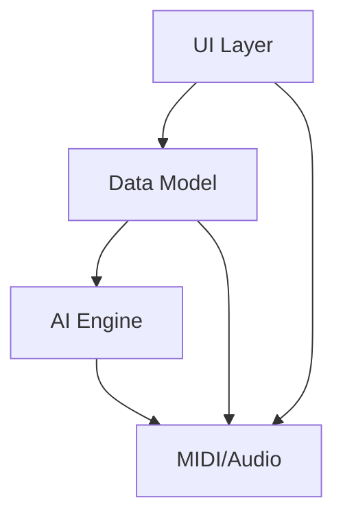
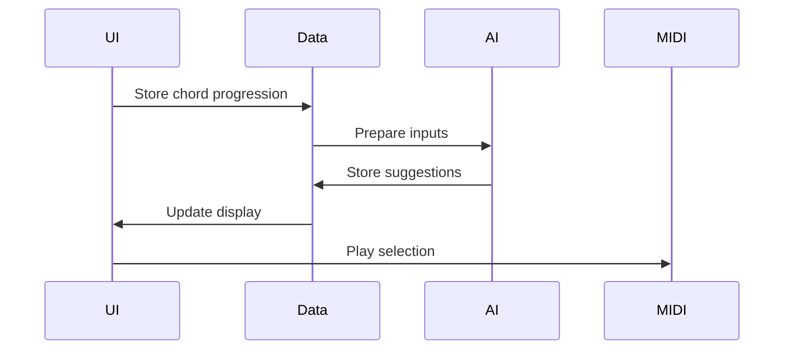

# ChordSeqM4L Complete Architecture

## System Overview

## Component Specifications

### 1. UI Layer (Max Patcher)
- Timeline display ([live.grid])
- Interactive controls ([live.* objects])
- Native theme integration

### 2. Data Model
- Chord progression storage ([dict])
- Preset management ([preset])
- State serialization ([json])

### 3. AI Engine
- ONNX runtime ([js] + ONNX.js)
- Model manager
- Inference scheduler

### 4. MIDI/Audio
- MIDI output ([midiout])
- Audio preview ([groove~])
- Timing sync ([transport])

## Data Flow

## Technical Requirements
1. Max 8.6+ (for ONNX.js support)
2. Ableton Live 11+
3. 2GB RAM minimum
4. Multi-threaded execution

## Implementation Checklist
- [ ] Core UI components
- [ ] Data model infrastructure
- [ ] AI integration
- [ ] MIDI/Audio pipeline
- [ ] Performance optimization
- [ ] Error handling
- [ ] Documentation