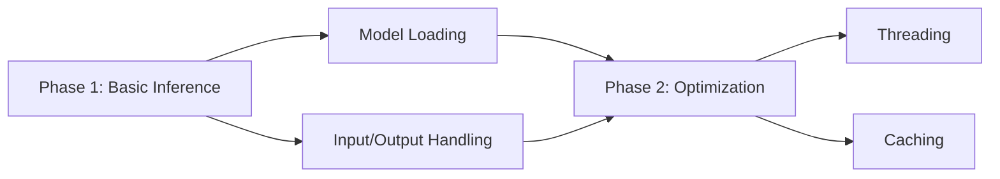

# ChordSeqM4L AI Integration (Enhanced)

## Model Specifications
### Supported Architectures
- Transformer (S/M/L)
- Conditional Transformer  
- Recurrent Network

```javascript
// Model Metadata Example
{
  "name": "conditional_medium",
  "input_shape": [64, 12],
  "output_size": 128, 
  "quantized": true,
  "size": "45MB"
}
```

## Detailed Workflow

### 1. Model Loading
```javascript
// Max JS Object Example
function loadModel() {
  const modelPath = getModelPath();
  const session = new ort.InferenceSession();
  try {
    await session.loadModel(modelPath);
   - Convert logits to probabilities
   - Sort suggestions by confidence
   - Filter invalid chords

## Performance Optimization
1. **Caching**:
   - Cache loaded models
   - Store recent inference results

2. **Threading**:
   - Run inference in background thread
   - Use [scheduler] for non-blocking execution

3. **Fallbacks**:
   - Progressive model loading (S→M→L)
   - CPU usage monitoring

## Implementation Phases


## Error Handling
1. Model loading failures
2. Input shape mismatches
3. GPU acceleration fallback
4. Memory warnings