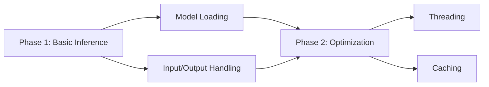

# ChordSeqM4L AI Integration Design

## Model Packaging
1. **Storage**:
   - Embed models in Max package using [folder] object
   - Compress models (quantized ONNX format)
   - Store in `~/Documents/Max/Packages/ChordSeqM4L/models`

2. **Loading**:
   ```javascript
   // JS model loader example
   const session = new ort.InferenceSession();
   await session.loadModel('./models/conditional_small.onnx');
   ```

## Inference Pipeline
1. **Input Preparation**:
   - Convert chord progression to tensor format
   - Add style/genre conditioning
   - Normalize inputs

2. **Execution**:
   ```max
   [prepend set_input]
   [js run_inference.js]
   [route get_output]
   ```

3. **Output Processing**:
   - Convert logits to probabilities
   - Sort suggestions by confidence
   - Filter invalid chords

## Performance Optimization
1. **Caching**:
   - Cache loaded models
   - Store recent inference results

2. **Threading**:
   - Run inference in background thread
   - Use [scheduler] for non-blocking execution

3. **Fallbacks**:
   - Progressive model loading (S→M→L)
   - CPU usage monitoring

## Implementation Phases


## Error Handling
1. Model loading failures
2. Input shape mismatches
3. GPU acceleration fallback
4. Memory warnings