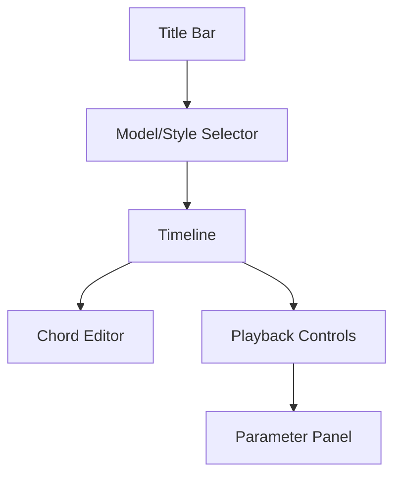

# ChordSeqM4L UI Specification

## Main Components

### 1. Timeline Display
- **Element**: `[live.grid]`
- **Features**:
  - Horizontal chord progression visualization
  - Color-coded chords
  - Playhead indicator
- **Dimensions**: 800x200 pixels
- **Interactions**:
  - Click to select chord
  - Drag to adjust duration

### 2. Chord Editor
- **Elements**: 
  - `[umenu]` for chord selection
  - `[live.text]` for variant selection
- **Features**:
  - Dropdown chord selector
  - Variant toggle buttons
  - Real-time piano roll preview

### 3. Playback Controls
- **Elements**:
  - `[live.button]` for play/pause
  - `[live.numbox]` for BPM
  - `[live.toggle]` for loop
- **Layout**: Horizontal control bar

### 4. Model/Style Selection
- **Elements**:
  - `[live.menu]` for model selection
  - `[live.radios]` for style/genre
- **Features**:
  - Dynamic model loading indicator
  - Style weighting controls

### 5. Parameter Panel
- **Elements**:
  - `[live.slider]` for zoom
  - `[live.dial]` for decay
  - `[live.gain]` for volume

## Layout Structure

## Design Guidelines
1. Follow Ableton's dark UI theme
2. Use `[live.colors]` for theme compatibility
3. Group related controls with `[live.tab]`
4. Maintain 1:1 feature parity with web UI
5. Add tooltips via inspector annotations

## Implementation Notes
- Use presentation mode for final layout
- Set `openinpresentation 1` in patcher properties
- Test all resolutions from 1024px width